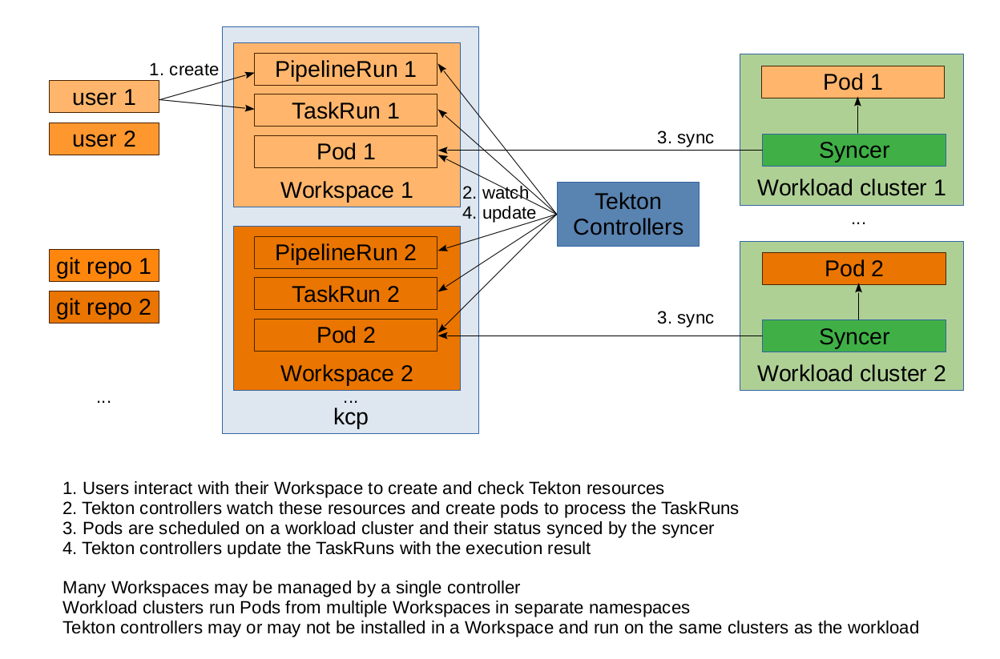

# Pipeline Service

Pipeline Service provides a SaaS for pipelines. It leverages:

- kcp for serving the API and acting as control plane
- Kubernetes / OpenShift for the compute
- Tekton Pipelines, Results and friends for the core of the service
- OpenShift GitOps / Argo CD, Pipelines as Code for managing the infrastructure

## Why Pipeline Service?

Tekton and Kubernetes provide a great infrastructure for build pipelines. They come however with some limitations.

- Multi-tenancy: Kubernetes provides a level of multi-tenancy. However, this does not extend to cluster scoped resources. CustomResourceDefinitions (CRD) are extensively used for extending the Kubernetes API, following [the operator pattern](https://kubernetes.io/docs/concepts/extend-kubernetes/operator/).  CRDs are cluster scoped. This induces a coupling between the operator version provided by the platform and what you can use as a tenant. The control plane is also shared between tenants.
- Scalability: Kubernetes has made it easy to distribute the load onto many servers and scalability at cloud scale more approachable. Like everything, its control plane has however its limits.
- Availability and geo-redundancy: Kubernetes control plane is based on an etcd cluster, which is sensible to latency between its members. This restricts what can be done in terms of geographical distribution.

kcp helps with mitigating these challenges, pushing the limits to new horizons.

Pipelines as Code is the veneer that brings to the users a great experience directly from their git repository.

**kcp - workspace isolation** (~3 min)

**kcp - scaling** (~3 min)

## Design

### Phase 1

In the first phase, Pipeline Service will leverage kcp Transparent-Multi-Cluster capabilities. Tekton and other controllers run directly on Kubernetes workload clusters and process the resources there. kcp syncer ensures that resources (Pipelines, PipelineRuns, etc.) created by users in their workspace are synced onto a workload cluster and the result of the processing is reflected to the user workspace.

This approach has the great advantage of not requiring any change to the controllers.

Controllers know nothing about kcp.

**Demos**

User (~3:30 min)

Platform installation (~4 min)

**[Limitations](./docs/phase1_limitations.md)**

### Phase 2

In the second phase, the controllers used by Pipeline Service are made kcp-aware. This eliminates the need to sync the pipeline resources onto workload clusters and to have operators directly bound to any kubernetes cluster.
This brings additional benefits:

- not being tied up to a version of pipeline CRDs installed on a Kubernetes cluster
- being able to scale controllers and distribute their load independently from the Kubernetes clusters
- flexibility in setting up failure domains

Tekton resource schemas are added only in kcp.

Kubernetes workload clusters know nothing about Tekton. They only run resources like Deployments, Pods and Services.

## How do I start?

### Running in Kubernetes or OpenShift

You can deploy this PoC to your Kubernetes cluster with the `build.sh` and `run.sh` scripts in `ckcp` folder.

More info [here](https://github.com/openshift-pipelines/pipeline-service/tree/main/ckcp)

## Running locally

See [the development guide](DEVELOPMENT.md) for instructions on how to set up a local development environment.
